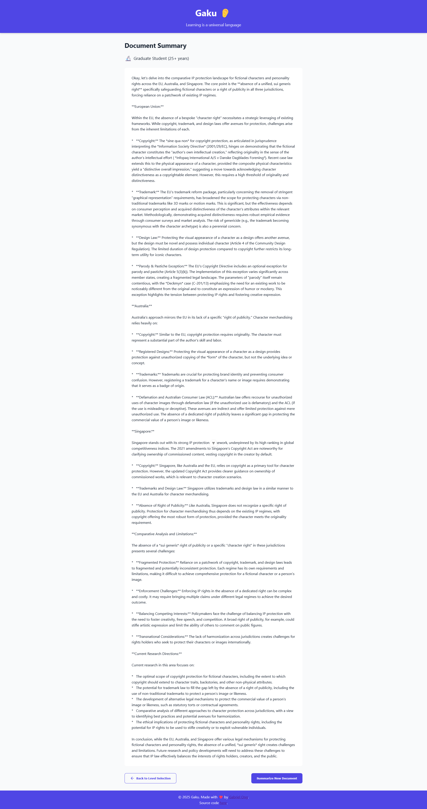

[](https://github.com/gongahkia/gaku/releases/tag/1.0.0)

# `Gaku` 👂

Full Stack Web App that reads a file and gives it the [r/explainlikeimfive](https://www.reddit.com/r/explainlikeimfive/) treatment.

`Gaku` ingests a [PDF/JPG/PNG](#screenshots) and breaks it down [10 different ways](#child).

<div align="center">
    
</div>

<div align="center">
    
</div>

## Stack

* Frontend *(Vue.js, Tailwind CSS, Netlify)*
* Backend *(JavaScript)*
* DB *(Supabase)*

## Usage

For local usage and debugging.

> [!IMPORTANT]  
> Read the [legal disclaimer](#legal-disclaimer) before using `Gaku`.  

1. Clone the repository.

```console
$ git clone https://github.com/gongahkia/gaku
$ cd gaku/gaku-app
```

2. Create a `.env` file of the following configuration and add your [Gemeni API key](https://ai.google.dev/gemini-api/docs/api-key).

```env
VITE_GEMINI_API_KEY=XXX
```

3. Run the below.

```console
$ npm install
$ npm run dev 
```

## Architecture


## Screenshots

<div style="display: flex; justify-content: space-between;">
  
  
</div>

<br>

> [!NOTE]  
> For context, the [below screenshots](#child) show `Gaku` summarizing an input document on character merchandising under IP Law in different jurisdictions.

### Child


### Teen


### College Student 


### Graduate Student 



### Expert


### Teacher


### Flash Cards


### Knowledege Graph


### Fries in the Bag


### r/PoorlyExplained


## Reference

The name `Gaku` is in reference to [Gaku](https://sakamoto-days.fandom.com/wiki/Gaku) (楽), an assassin under [X's Organization](https://sakamoto-days.fandom.com/wiki/X%27s_Organization) who grew up alongside [Kei Uzuki](https://sakamoto-days.fandom.com/wiki/Kei_Uzuki) at [Al-Kamar Orphanage](https://sakamoto-days.fandom.com/wiki/Al-Kamar_Orphanage). He first makes an appearance in the [Death Row Prisoners Arc](https://sakamoto-days.fandom.com/wiki/Death_Row_Prisoners_Arc), where he aids Slur in the onslaught of the Tokyo Branch of the the [JAA](https://sakamoto-days.fandom.com/wiki/Japanese_Association_of_Assassins) as part of the ongoing manga series [Sakamoto Days](https://sakamoto-days.fandom.com/wiki/Sakamoto_Days_Wiki). Gaku (学) also roughly translates to "learning" or "scholarship" in Japanese.

<div align="center">
    
</div>

## Legal Disclaimer

The Gaku application ("Gaku") is provided "AS IS" and "AS AVAILABLE," without warranty of any kind, express or implied. By using Gaku, you acknowledge that you have read, understood, and agree to be bound by this disclaimer's below terms and limitations.

### No Responsibility Disclaimer

The information provided by Gaku through its document summarization services is for general informational purposes only. Gaku and its creators make no representation or warranty of any kind, express or implied, regarding the accuracy, adequacy, validity, reliability, availability, or completeness of any information generated through the application.

### Use at Your Own Risk

Your use of Gaku and its features is entirely at your own risk. Gaku's creators and contributors shall not be liable for any errors or omissions in the content provided, nor for any actions taken in reliance thereon.

### AI-Generated Content Limitations

Summaries and other content generated by Gaku using the Gemini API are created through artificial intelligence and may contain inaccuracies, misinterpretations, or incomplete information. Users should:

* Not rely solely on AI-generated summaries for critical decisions
* Verify all information against original source documents
* Understand that AI summarization is not a substitute for professional advice or thorough document review

### No Professional Advice

Gaku does not provide legal, financial, medical, or other professional advice. The summaries and information generated should not be construed as professional consultation or advice. Users requiring professional guidance should consult qualified professionals in the relevant field.

### Intellectual Property

Users are responsible for ensuring they have the necessary rights to upload and process documents through Gaku. The application does not claim ownership of user-uploaded content, but users grant Gaku the right to process and analyze such content for the purpose of providing summarization services.

### Third-Party Services

Gaku utilizes third-party services including but not limited to OCR services and the Gemini API. The use of these services is subject to their respective terms and conditions. Gaku's creators are not responsible for the performance, availability, or policies of these third-party services.

### Limitation of Liability

Under no circumstances shall Gaku's creators or contributors be liable for any indirect, incidental, special, consequential, or punitive damages resulting from your use of or inability to use the application.

### Changes to Disclaimer

This disclaimer may be updated from time to time without notice. It is your responsibility to review this disclaimer periodically for changes.