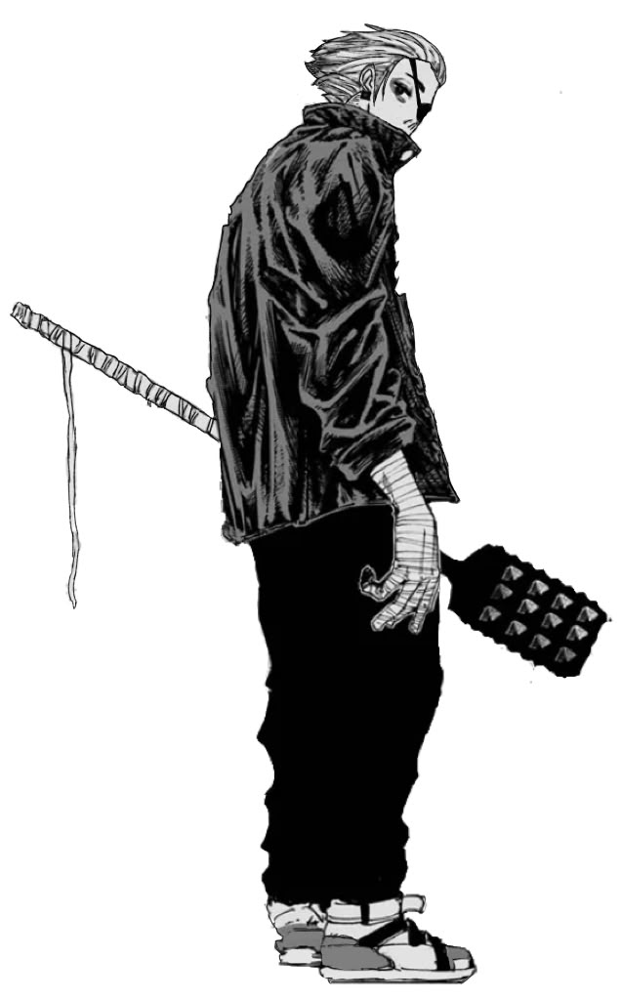

# `Gaku` 👂

Full Stack Web App that ingests any file format and gives it the [r/explainlikeimfive](https://www.reddit.com/r/explainlikeimfive/) treatment.

## Rationale

...

## Usage

For local usage and debugging.

1. Clone the repository.

```console
$ git clone https://github.com/gongahkia/gaku
$ cd gaku/gaku-app
```

2. Create a `.env` file of the following configuration and add your [Gemeni API key](https://ai.google.dev/gemini-api/docs/api-key).

```env
VITE_GEMINI_API_KEY=XXX
```

3. Run the below.

```console
$ npm install
$ npm run dev 
```

## Screenshots

<div style="display: flex; justify-content: space-between;">
  
  
</div>

<div style="display: flex; justify-content: space-between;">
  
  
</div>

<div style="display: flex; justify-content: space-between;">
  
  
</div>

<div style="display: flex; justify-content: space-between;">
  
  
</div>

<div style="display: flex; justify-content: space-between;">
  
  
</div>

## Stack

* Frontend *(Vue.js, Tailwind CSS, Netlify)*
* Backend *(JavaScript)*
* [Gemeni Developer API](https://ai.google.dev/)

## Architecture

```mermaid
```

## Disclaimer

...

## Reference

The name `Gaku` is in reference to [Gaku](https://sakamoto-days.fandom.com/wiki/Gaku) (楽), an assassin under [X's Organization](https://sakamoto-days.fandom.com/wiki/X%27s_Organization) who grew up alongside [Kei Uzuki](https://sakamoto-days.fandom.com/wiki/Kei_Uzuki) at [Al-Kamar Orphanage](https://sakamoto-days.fandom.com/wiki/Al-Kamar_Orphanage). He first makes an appearance in the [Death Row Prisoners Arc](https://sakamoto-days.fandom.com/wiki/Death_Row_Prisoners_Arc), where he aids Slur in the onslaught of the Tokyo Branch of the the [JAA](https://sakamoto-days.fandom.com/wiki/Japanese_Association_of_Assassins) as part of the ongoing manga series [Sakamoto Days](https://sakamoto-days.fandom.com/wiki/Sakamoto_Days_Wiki). Gaku (学) also roughly translates to "learning" or "scholarship" in Japanese.

<div align="center">
    
</div>
